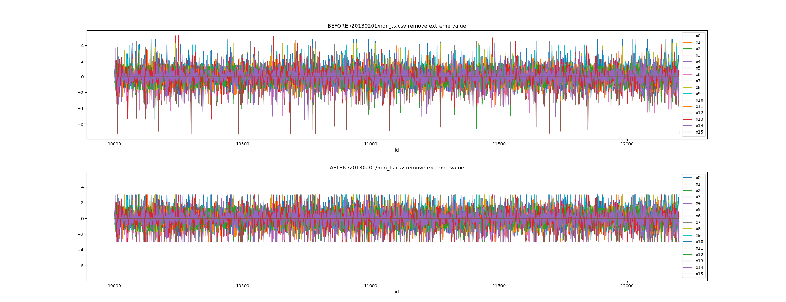

# stock-prediction

股票预测。

## 1 数据简介

1. 非时间序列类型指标
    - 代表股票的一些基本特性。
    - 其中有部分连续指标做过正态化，也包含部分不连续指标（离散或缺失）。
    - `flag` 一列带买哦股票的分类属性，属于类别指标。

2. 时间序列类型指标
    - {t0, t1, t2..., t20} 代表股票的某一个属性。
    - 并未全部做过正态化处理。

3. 股票未来收益
    - 存储在 `y.csv`

### 训练数据

- 2013/02 - 2017/03

```
├── 20130201 数据选取时间
│   ├── non_ts.csv 非时间序列类型指标
│   ├── ts_1.csv 时间序列类型指标
│   ├── ts_2.csv 时间序列类型指标
│   ├── ts_3.csv 时间序列类型指标
│   ├── ts_4.csv 时间序列类型指标
│   ├── ts_5.csv 时间序列类型指标
│   └── y.csv 股票未来收益
├── 20130204
...
```

### 测试数据

- 2017/04 - 2018/09

```
├── 20170330 数据选取时间
│   ├── non_ts.csv 非时间序列类型指标
│   ├── ts_1.csv 时间序列类型指标
│   ├── ts_2.csv 时间序列类型指标
│   ├── ts_3.csv 时间序列类型指标
│   ├── ts_4.csv 时间序列类型指标
│   └── ts_5.csv 时间序列类型指标
├── 20170331
...
```

## 2 预处理

### 2.1 去极值

> 如果数据服从正态分布，在3σ原则下，异常值被定义为与平均值的偏差超过了3倍标准差的值。
> 这是因为，在正态分布的假设下，具体平均值3倍标准差之外的值出现的概率低于0.003，属于极个别的小概率事件。

使用上述方法去极值前后对比图如下：



## 3 使用方法

本项目使用的 Python 版本必须大于 3.6.0，环境配置参考[这里](https://www.v2ai.cn/linux/2018/04/29/LX-2.html)。

```bash
git clone https://github.com/kinggreenhall/stock-prediction.git

cd stock-prediction

# 安装依赖
pip install -r requirements.txt

# 自定义你的配置
vi config.yaml

# 每次运行需要手动替换配置中的 $model_name
python -m run.sklearn
```

## 4 结果

| 序号 | 模型类型 | 模型名称 |标准化 + 中性化 + 3折交叉验证 R-Square |
| :-: | :- | :- | :- |
| 1 | linear | SGDRegressor | 0.009278 |
| 2 | linear | HuberRegressor | -0.001619 |
| 3 | linear | LinearRegression | 0.009210 |
| 4 | svm | LinearSVR | -0.014114 |
| 5 | ensemble | BaggingRegressor | -0.132400 |
| 6 | ensemble | AdaBoostRegressor | -0.794503 |
| 7 | ensemble | ExtraTreesRegressor | -0.121669 |
| 8 | ensemble | RandomForestRegressor | -0.132016 |
| 9 | ensemble | GradientBoostingRegressor | 0.009432 |

## 5 其他

Q: 数据在哪里？

A: 好问题！别急，先等等。
